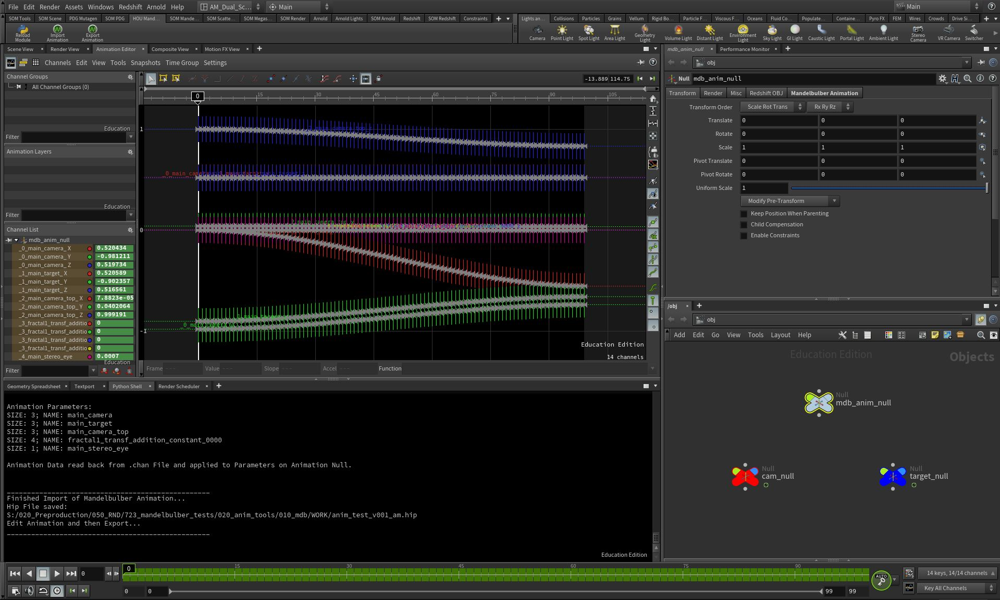

Mandelbulber VFX Tools
==========================

*Tools and Scripts to integrate Mandelbulber Fractal Software into VFX Pipelines*

<br>

## About
**Mandelbulber VFX Tools** is a work in progress collection of little Tools and helper Scripts to integrate *Mandelbulber* Fractals into a VFX Pipeline.
Mainly *©SideFX Houdini* and *©The Foundry's Nuke*.
All the code is developed during my studies at Animationsinstitut at Filmakademie Baden-Württemberg in the course Animation & Visual Effects.

<br>

### Code State | Bugs | Compatibility
**Mandelbulber VFX Tools** is in a work in progress, prototype stage and for experimental use.
It may contain bugs and the code is not fully cleaned up. Feel free to customize and enhance to your needs.

*Compatible with **Houdini 17.+ | Tested with 17.5.425***
*Compatible with **Mandelbulber 2.22+ | Tested with 2.22***

<br>

## Installation
* Clone or copy repository.
Add path to repository into **HOUDINI_PATH** environment variable (e.g. in *houdini.env* file)
    ```
    HOUDINI_PATH = &;C:/Users/ameyer/Documents/git/mandelbulber_vfx_tools/houdini
    ```
* Add **HOU Mandelbulber** shelf to Houdini shelfes

* Nuke Tools not yet released...

* Optional: Git SVN
Download SVN
Run the following command:
	```
	svn export https://github.com/buddhi1980/mandelbulber2.git/trunk/contrib/vfx_tools
	```

<br>

## How to Use
#### Houdini Animation Editing
* Open Houdini / Open Animation Editor / Open Python Shell / Open *HOU Mandelbulber Shelf*
* Click on *Import Animation* Shelf Tool and select .fract File
* Edit Keyframes in Houdini Animation Editor Pane
* Export back to Mandelbulber .fract File with *Export Animation* Shelf Tool

#### Import Mandelbulber Camera to Houdini
* Open Houdini / Open Python Shell / Open *HOU Mandelbulber Shelf*
* Click on *Create MDB Cam* Shelf Tool and select first Frame of Mandelbulber .exr Sequence
* A animated Houdini Camera matching the Mandelbulber Camera will be created based on .exr Metadata
* Can be used within Houdini or exported as Alembic
* Supports Perspective, Stereo, Equirectangular and Stereo Equirectangular Cameras

<br>

## Resources
* [Mandelbulber GitHub](https://github.com/buddhi1980/mandelbulber2)
* [Mandelbulber Website](https://www.mandelbulber.com/)

<br>

## Credits
* Mandelbulber VFX Tools are developed during my studies at Animationsinstitut at Filmakademie Baden-Württemberg in the course Animation & Visual Effects.
* https://animationsinstitut.de/
* https://www.filmakademie.de/

<br>

## Thanks
Thanks a lot for helping making Mandelbulber more useable in Animation and VFX!
* [Krzysztof Marczak](https://github.com/buddhi1980) - Main Developer of Mandelbulber
* [Sebastian Jennen](https://github.com/buddhi1980) - Developer of Mandelbulber
* [MCLarekin](https://github.com/mclarekin) - Developer of Mandelbulber

<br>